<div align="center">

# 👋 Sayam Mukherjee
### B.Tech CSE (AI & ML) @ KIIT University

Artificial Intelligence · Machine Learning · Computer Vision · Full Stack · DSA

Building practical software and AI-powered products that solve real problems.

<br/>

<a href="https://github.com/codesbysayam"></a>
<a href="https://github.com/codesbysayam?tab=followers"></a>
<a href="https://github.com/codesbysayam?tab=repositories"></a>

<br/><br/>

<a href="https://github.com/codesbysayam"></a>
<a href="https://www.linkedin.com/in/sayam-mukherjee-b96209324/"></a>
<a href="https://www.sayammukherjee.in"></a>

</div>

---

# 👨‍💻 Who I Am

<div align="center">

```text
┌──────────────────────────────────────────────────────────┐
│                    SAYAM MUKHERJEE                      │
│                                                          │
│       B.Tech CSE — Artificial Intelligence & ML         │
│                    KIIT University                       │
│                                                          │
│              Expected Graduation: 2029                  │
│                                                          │
│       AI • ML • Computer Vision • Full Stack • DSA     │
└──────────────────────────────────────────────────────────┘
```

</div>

```javascript
const sayamMukherjee = {
  name: "Sayam Mukherjee",
  username: "codesbysayam",
  education: "B.Tech Computer Science Engineering",
  specialization: "Artificial Intelligence & Machine Learning",
  university: "KIIT University",
  expectedGraduation: 2029,
  cgpa: "9.06 — First Year Overall",
  focus: ["Artificial Intelligence", "Machine Learning", "Computer Vision", "Generative AI", "Full Stack Development", "Data Structures & Algorithms"],
  roles: ["Student Developer", "Freelancer", "Content Creator", "Builder"],
  goal: "Software Engineer + AI Engineer",
  motto: "Learn. Build. Experiment. Ship."
};
```

## ⚡ About Me

I'm **Sayam Mukherjee**, a **B.Tech Computer Science Engineering student specializing in Artificial Intelligence & Machine Learning at KIIT University**, expected to graduate in **2029**.

I enjoy combining **AI, software engineering, full-stack development and product thinking** to turn ideas into practical digital products.

> **Don't just learn technology. Build something with it.**

---

# 🚀 Featured Projects

### 🌦️ MAUSAM — Intelligent Weather & Environmental Platform
**Smart India Hackathon 2026 · SIH26076 · Team Algnite**

A weather and environmental platform for travelers, commuters, farmers, outdoor fitness enthusiasts, parents and event planners. It combines forecasts with environmental intelligence and actionable visualization.

**Highlights:** Weather & forecasts · AQI · pollen · UV index · humidity · sunrise/sunset · best outdoor activity hours · tides · soil moisture · interactive maps · state/UT information · data visualization · CSV/Excel reports · IMD-oriented integration · WRF/GEFS/ECMWF concepts.

**Stack:** `React` `JavaScript` `Tailwind CSS` `Maps` `Weather APIs` `Vercel`

### 🤖 YOLOv8 Edge CV — Real-Time Multi-Object Detection & Tracking
A computer-vision pipeline focused on real-time detection, tracking and edge-oriented AI.

**Core:** `YOLOv8` `PyTorch` `OpenCV` `Object Detection` `Multi-Object Tracking` `Deep Learning` `Edge AI`

### 🏋️ Fitness OS Pro — Fitness & Wellness SaaS
Cross-platform fitness ecosystem covering workout management, nutrition, progress tracking, subscriptions, coupons, payments and administration.

**Features:** Workout management · fitness & nutrition · progress tracking · subscription plans · coupon codes · Razorpay integration · admin dashboard · Android/iOS/Web concept.

**Stack:** `React` `Node.js` `MongoDB` `Tailwind CSS` `Razorpay`

### 💰 Expense Analyzer — Personal Finance Analysis
Application concept for analyzing expenses, spending patterns and financial insights through visualization.

**Focus:** `Expense Analysis` `Spending Patterns` `Financial Insights` `Data Visualization` `FinTech`

### 📊 Finance Tracker — Personal Finance Management
Tracks expenses, financial activity and investments with a focus on personal-finance monitoring and visualization.

**Focus:** `Personal Finance` `Expense Tracking` `Investment Tracking` `Financial Analysis`

### 🧠 MEMORY IN MOTION — Recurrent Memory for In-Context Learning
**DataForge 2026 · KDAG IIT Kharagpur · Pathway: Explain the Frontier · Finalist**

Explores **In-Context Learning with Recurrent Memory**: a fixed-size recurrent state can carry task-relevant information forward without growing a token-by-token memory, while compression can introduce **interference and forgetting**.

**Focus:** `AI Research` `Machine Learning` `In-Context Learning` `Recurrent Memory`

---

# 🧠 More Projects & Product Concepts

Personal Well-Being Manager · Fitness & Nutrition Applications · Finance Applications · Expense Analysis · Full Stack Applications · AI-powered Tools · Computer Vision Pipelines · Cross-platform Applications · SaaS Platforms

---

# 🛠️ Tech Stack

### 💻 Languages
<div align="center"></div>

### 🌐 Frontend
<div align="center"></div>

### ⚙️ Backend & Database
<div align="center"></div>

### 🤖 AI / ML / Computer Vision
<div align="center"></div>

### 🔧 Tools & Platforms
<div align="center"></div>

---

# 🧩 Skill Matrix

| Domain | Technologies / Focus |
|:---|:---|
| 🤖 AI | Artificial Intelligence, Generative AI |
| 🧠 ML | Machine Learning, Deep Learning |
| 👁️ Computer Vision | YOLOv8, PyTorch, Object Detection, Tracking |
| 💻 Development | Full Stack, Web Development |
| 🎨 Frontend | React, Bootstrap, Tailwind CSS |
| ⚙️ Backend | Node.js, MongoDB |
| 🧩 DSA | Data Structures & Algorithms |
| 🔐 Security | Ethical Hacking / Cybersecurity Interest |
| 🎨 Design | Figma, Canva |
| 🔧 Tools | Git, GitHub, VS Code, Vercel |
| 📊 Finance | Stock Market, FinTech |

---

# 💼 What I Do

### 💻 Software & AI
Artificial Intelligence · Machine Learning · Computer Vision · Full Stack Development · Web Development · DSA · AI Product Development · SaaS · Responsive Applications · Data Visualization

### 🎨 Freelancing
YouTube Thumbnail Design · Social Media Content Creation · Social Media Growth · Monetization · Google Ads · Meta Ads · Digital Marketing

📧 **Business:** `wrickbusiness@gmail.com`

---

# 🎥 YouTube Content Creation

### ⚡ Technical AZ
Technology, coding, AI and developer-focused content.

### 🌍 Daily Decipher
Travel, culture, adventure, facts and sports content.

### 🖤 Obsidian Optics
Technology, future trends, finance, psychology, motivation, facts and perspective-changing content.

---

# 🏆 Achievements & Activities

### 🚀 Smart India Hackathon 2026
**Software Track · Problem Statement `SIH26076` · Team `Algnite` · Project MAUSAM**

### 🧠 DataForge 2026 — KDAG, IIT Kharagpur
**Finalist · Pathway: Explain the Frontier · MEMORY IN MOTION**

### 🧠 Technex'26 — IIT BHU
**Finalist**

### 🧩 Toycathon 2021
**National-level finals / Top 15**

### 🎉 KIIT Fest
Participant / contributor.

### 🏓 Table Tennis
2013 — Started playing · 2019 — Represented district · 2021 — Reached finals / Top 15 level

---

# 🎓 Academic Journey

<div align="center">

| Qualification | Result |
|:---|:---:|
| 🏫 Class 10 — CBSE | **92.6%** |
| 🏫 Class 12 — CBSE | **86.2%** |
| 🎓 First Year Overall CGPA | **9.06** |
| 💻 Degree | **B.Tech CSE (AI & ML)** |
| 🏛️ University | **KIIT University** |
| 🎯 Expected Graduation | **2029** |

</div>

---

# 🚀 Hackathons, Competitions & Events

| Event | Details / Result |
|:---|:---|
| **Smart India Hackathon 2026** | Software Track · `SIH26076` · Team Algnite · MAUSAM |
| **DataForge 2026** | KDAG, IIT Kharagpur · Explain the Frontier · **Finalist** · MEMORY IN MOTION |
| **Technex'26** | IIT BHU · **Finalist** |
| **Toycathon 2021** | National-level finals / **Top 15** |
| **KIIT Fest** | Participant / Contributor |
| **Other Hackathons & Coding Contests** | Multiple technology events |

---

# 💰 Finance & Investing

Interested in the intersection of **technology, finance and investing**.

📈 Stock Market · 💰 Mutual Funds · 📊 Financial Analysis · 💸 Personal Finance · 📱 FinTech · 📊 Investment Tracking

---

# 🎯 Current Focus

<div align="center">`ARTIFICIAL INTELLIGENCE` → `MACHINE LEARNING` → `COMPUTER VISION` → `GENERATIVE AI` → `FULL STACK` → `DSA` → `AI PRODUCTS` → `SOFTWARE ENGINEERING`</div>

---

# 📊 GitHub Statistics

<div align="center">


</div>

---

# 🔥 GitHub Streak

<div align="center"></div>

---

# 🏆 GitHub Trophies

<div align="center"></div>

---

# 📈 Contribution Graph

<div align="center">

</div>

---

# 🐍 Contribution Snake

<div align="center">
<picture>
<source media="(prefers-color-scheme: dark)" srcset="https://raw.githubusercontent.com/codesbysayam/codesbysayam/output/github-snake-dark.svg">
<source media="(prefers-color-scheme: light)" srcset="https://raw.githubusercontent.com/codesbysayam/codesbysayam/output/github-snake.svg">

</picture>
</div>

---

# 📌 Quick Facts

<div align="center">

| | |
|:---|:---|
| 👨‍💻 Name | **Sayam Mukherjee** |
| 🐙 GitHub | **codesbysayam** |
| 🎓 Degree | **B.Tech CSE (AI & ML)** |
| 🏛️ University | **KIIT University** |
| 🎯 Graduation | **2029** |
| 📊 First Year CGPA | **9.06** |
| 🤖 Primary Domain | **AI & Machine Learning** |
| 👁️ Special Interest | **Computer Vision** |
| 💻 Development | **Full Stack / Web** |
| 🧩 Problem Solving | **DSA** |
| 🎨 Freelancing | **Design / Content / Digital Marketing** |
| 🎥 YouTube | **Technical AZ · Daily Decipher · Obsidian Optics** |
| 🏓 Sport | **Table Tennis** |
| 📷 Hobby | **Photography** |
| 🎮 Hobby | **Gaming** |

</div>

---

# 🤝 Connect With Me

<div align="center">
<a href="https://github.com/codesbysayam"></a>
<a href="https://www.linkedin.com/in/sayam-mukherjee-b96209324/"></a>
<a href="https://www.sayammukherjee.in"></a>
<br/><br/>
<a href="mailto:sayammukherjee1506@gmail.com"></a>
<a href="mailto:wrickbusiness@gmail.com"></a>
</div>

---

# 💬 Developer Philosophy

<div align="center">> **Learn. Build. Experiment. Ship.**</div>

<div align="center"><sub>Profile assets are generated automatically through GitHub Actions.</sub></div>
