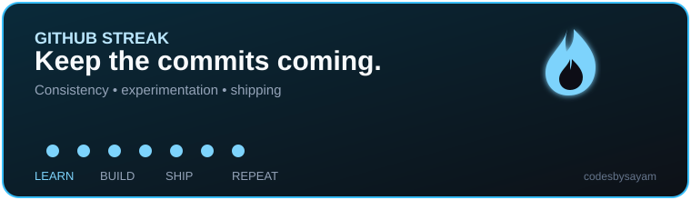
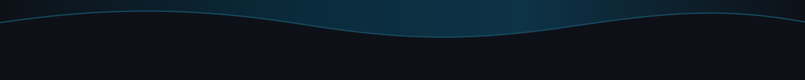

<!-- ========================================================= -->
<!--                    ANIMATED HEADER                        -->
<!-- ========================================================= -->


<div align="center">
  
</div>

<div align="center">
  
</div>

<br/>

<div align="center">
  <a href="https://github.com/codesbysayam"></a>
  &nbsp;
  <a href="https://github.com/codesbysayam?tab=followers"></a>
  &nbsp;
  <a href="https://github.com/codesbysayam?tab=repositories"></a>
  &nbsp;
  <a href="https://www.linkedin.com/in/sayam-mukherjee-b96209324/"></a>
  &nbsp;
  <a href="mailto:sayammukherjee1506@gmail.com"></a>
</div>

---

## 🧑‍💻 Who I Am


```typescript
const sayamMukherjee = {
  name: "Sayam Mukherjee",
  title: "B.Tech CSE — AI & ML Student",
  university: "KIIT University",
  graduation: 2029,
  cgpa: "9.06 — First Year Overall",
  stack: {
    frontend: ["React", "JavaScript", "Tailwind CSS", "Bootstrap", "Figma"],
    backend: ["Node.js", "MongoDB"],
    ai: ["Python", "Machine Learning", "Deep Learning", "Generative AI"],
    vision: ["YOLOv8", "PyTorch", "OpenCV", "Object Detection", "Tracking"],
    tools: ["Git", "GitHub", "VS Code", "Vercel", "Canva"]
  },
  currentlyBuilding: ["MAUSAM", "MEMORY IN MOTION", "YOLOv8 Edge CV"],
  roles: ["Student Developer", "Freelancer", "Content Creator", "Builder"],
  openTo: ["Internships", "Collaborations", "AI/ML & Software Opportunities"],
  goal: "Become a Software Engineer + AI Engineer",
  motto: "Learn. Build. Experiment. Ship."
};
```

<br clear="right"/>

---

## ⚡ About Me

I'm **Sayam Mukherjee**, a B.Tech Computer Science Engineering student specializing in **Artificial Intelligence & Machine Learning** at KIIT University, graduating in 2029.

I enjoy working at the intersection of **AI, software engineering and product development** — turning ideas into functional, user-focused digital products.

### 🔭 Currently Exploring

- 🤖 Artificial Intelligence
- 🧠 Machine Learning & Deep Learning
- 👁️ Computer Vision
- 🌐 Full Stack Development
- 🧩 Data Structures & Algorithms
- 🚀 AI-powered SaaS Products
- 📊 Data & Visualization
- 💰 FinTech & Stock Market

> **Don't just learn technology. Build something with it.**

---

## 🚀 Featured Projects

### 🌦️ MAUSAM — *Intelligent Weather & Environmental Platform*
> Smart India Hackathon 2026 · Problem Statement **SIH26076** · Team **Algnite**

<div align="center">
  <a href="https://github.com/codesbysayam/mausam">
    
  </a>
</div>

A comprehensive weather and environmental platform for health-conscious users, outdoor fitness enthusiasts, travelers, parents, agriculture, commuters and event planners.

| Layer | Technology |
|---|---|
| **Weather** | Weather information · Forecasting · IMD-oriented data |
| **Environment** | AQI · Pollen · UV · Humidity · Soil Moisture |
| **Astronomy & Outdoor** | Sunrise/Sunset · Best activity hours · Tide information |
| **Maps & Data** | Interactive Maps · State/UT-wise data · Visualization |
| **Reports & Models** | CSV/Excel Reports · WRF · GEFS · ECMWF concepts |
| **Stack** | React · JavaScript · Tailwind CSS · Weather APIs · Vercel |

🌐 **Code →** [github.com/codesbysayam/mausam](https://github.com/codesbysayam/mausam)

---

### 🤖 YOLOv8 Edge CV — *Real-Time Multi-Object Detection & Tracking*
> Computer Vision · Deep Learning · Edge AI

A real-time computer vision pipeline focused on object detection and multi-object tracking using modern deep-learning technologies.

| Layer | Technology |
|---|---|
| **Detection** | YOLOv8 |
| **Deep Learning** | PyTorch |
| **Vision** | OpenCV · Computer Vision |
| **Tracking** | Multi-Object Tracking |
| **Deployment Focus** | Edge AI |

**Core:** `YOLOv8` · `PyTorch` · `OpenCV` · `Object Detection` · `Tracking` · `Edge AI`

---

### 🏋️ Fitness OS Pro — *Fitness & Wellness SaaS Platform*
> Workouts · Nutrition · Progress · Subscriptions · Payments · Admin

A comprehensive fitness ecosystem concept spanning mobile, web and administrative interfaces.

| Layer | Technology |
|---|---|
| **Core** | Workout management · Fitness & nutrition · Progress tracking |
| **Accounts** | User profiles · Subscription plans · Coupon codes |
| **Payments** | Razorpay integration |
| **Platforms** | Android · iOS · Responsive Web |
| **Admin** | Administrative dashboard |

**Stack:** `React` · `Node.js` · `MongoDB` · `Tailwind CSS` · `Razorpay`

---

### 💰 Expense Analyzer — *Personal Finance Analysis*

A finance-oriented application concept for analyzing expenses, understanding spending patterns and improving personal financial awareness.

**Focus:** `Finance` · `Data Analysis` · `Visualization` · `Web Development`

---

### 📊 Finance Tracker — *Personal Finance Management*

A digital finance-management project focused on tracking financial activity, expenses and investments through a structured interface.

**Focus:** `FinTech` · `Finance Management` · `Data Visualization` · `Web Development`

---

### 🧠 MEMORY IN MOTION — *Recurrent Memory for In-Context Learning*
> DataForge 2026 · KDAG, IIT Kharagpur · Pathway: **Explain the Frontier** · **Finalist**

<div align="center">
  <a href="https://github.com/codesbysayam/Memory-in-Motion">
    
  </a>
</div>

Explores how a fixed-size recurrent state can carry task-relevant information forward without token-by-token memory growth, while compression introduces **interference and forgetting**.

**Focus:** `AI Research` · `Machine Learning` · `In-Context Learning` · `Recurrent Memory`

---

## 🎬 YouTube Content Creation

### Technical AZ
Technology, coding, AI and developer-focused content.

### Daily Decipher
Travel, culture, adventure, facts and sports content.

### Obsidian Optics
Technology, future trends, finance, psychology, motivation and perspective-changing facts.

---

## 🛠️ Tech Stack

### Languages
<p></p>

### Frontend
<p></p>

### Backend & Database
<p></p>

### AI / ML / Computer Vision
<p>
  
  
  
</p>

### Tools & Platforms
<p>
  
  
</p>

---

## 🧠 Skill Matrix

| Domain | Technologies / Focus |
|---|---|
| 🤖 AI | Artificial Intelligence · Generative AI |
| 🧠 ML | Machine Learning · Deep Learning |
| 👁️ Computer Vision | YOLOv8 · PyTorch · OpenCV · Object Detection |
| 💻 Development | Full Stack · Web Development |
| 🎨 Frontend | React · Bootstrap · Tailwind CSS |
| ⚙️ Backend | Node.js · MongoDB |
| 🧩 DSA | Data Structures & Algorithms |
| 🎨 Design | Figma · Canva |
| 🔧 Tools | Git · GitHub · VS Code · Vercel |
| 📊 Finance | Stock Market · FinTech |

---

## 💼 What I Do

### 💻 Software & AI
- AI / ML development
- Full Stack Web Development
- Computer Vision
- DSA & problem solving
- AI-powered product development
- Responsive web applications
- SaaS product development

### 🎨 Freelancing
- YouTube Thumbnail Design
- Social Media Content Creation
- Social Media Growth
- Google Ads
- Meta Ads
- Digital Marketing

---

## 🏆 Achievements & Highlights

<div align="center">
  
  &nbsp;
  
  &nbsp;
  
  &nbsp;
  
</div>

### 🧩 Toycathon 2021
Reached the **National-level finals / Top 15** in Toycathon 2021.

### 🏓 Table Tennis
Started playing in 2013 · Represented district level in 2019 · Reached finals / Top 15 level in 2021.

### 🎓 Academic Performance

| Qualification | Result |
|---|---:|
| Class 10 CBSE | **92.6%** |
| Class 12 CBSE | **86.2%** |
| First Year Overall CGPA | **9.06** |
| Degree | **B.Tech CSE (AI & ML)** |
| University | **KIIT University** |
| Expected Graduation | **2029** |

### 🚀 Competitions & Events

- 🏆 Toycathon 2021
- 🧠 Technex'26 — IIT BHU — **Finalist**
- 🎉 KIIT Fest
- 💻 Hackathons & Coding Events
- 🚀 Smart India Hackathon 2026 — Team **Algnite**
- 🧠 DataForge 2026 — KDAG, IIT Kharagpur — **Finalist**

---

## 📊 GitHub Stats

<div align="center">
  
  &nbsp;
  
</div>

<br/>

<div align="center">
  
</div>

---

## 🏆 GitHub Trophies

<div align="center">
  
</div>

---

## 📈 Contribution Graph

<div align="center">
  
</div>

---

## 🐍 Contributions Snake

<div align="center">
  <picture>
    <source media="(prefers-color-scheme: dark)" srcset="https://raw.githubusercontent.com/codesbysayam/codesbysayam/output/github-snake-dark.svg" />
    <source media="(prefers-color-scheme: light)" srcset="https://raw.githubusercontent.com/codesbysayam/codesbysayam/output/github-snake.svg" />
    
  </picture>
</div>

---

## 🎯 Current Focus

```text
Artificial Intelligence
        ↓
Machine Learning
        ↓
Computer Vision
        ↓
Generative AI
        ↓
Full Stack Development
        ↓
Data Structures & Algorithms
        ↓
AI-powered Product Building
        ↓
Software Engineering
```

## 🌱 Learning & Building

```text
Learn
  ↓
Experiment
  ↓
Build
  ↓
Break Things
  ↓
Debug
  ↓
Improve
  ↓
Ship
```

I'm continuously working toward becoming a stronger **Software Engineer + AI Engineer**, while building useful products and exploring new technologies.

---

## 🤝 Let's Connect

<div align="center">
  <a href="https://github.com/codesbysayam"></a>
  &nbsp;
  <a href="https://www.linkedin.com/in/sayam-mukherjee-b96209324/"></a>
  &nbsp;
  <a href="https://www.sayammukherjee.in"></a>
  &nbsp;
  <a href="mailto:sayammukherjee1506@gmail.com"></a>
</div>

<br/>

<div align="center">
  
</div>

<br/>

<!-- ========================================================= -->
<!--                    ANIMATED FOOTER                        -->
<!-- ========================================================= -->

